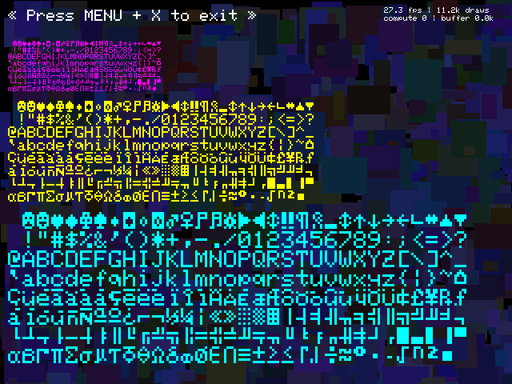

# SimpleGFX

SimpleGFX is a straightforward tool designed to help you create graphics using SDL 1.2 or SDL 2. It supports development for the Anbernic RG35xx running Onion OS 1.4.9 and can also be used on macOS for experimenting, building, and testing small graphical applications.

## Features

- Compatibility with SDL 1.2 and SDL 2.
- Supports macOS and RG35xx platforms.
- Basic text rendering functionality.
- 16-bit tone generation for simple sound effects.
- Minimal dependencies for portability and ease of use.



## System Requirements

### macOS

- Docker installed and set up.
- SDL2 (`brew install sdl2`)
- SDL 1.2 compatibility (`brew install sdl12-compat`)

### RG35xx

- Onion OS 1.4.9
- ADB enabled on the device

## Installation

### macOS

Run the following commands to build and test the application:

```bash
# Using SDL2
make gfx && ./build/gfx

# Using SDL1.2
make gfx1.2 && ./build/gfx
```

### RG35xx

To build and install the application on RG35xx:

```bash
make RG35xx-adb-install
```

Ensure that ADB is properly configured and the device is connected before running this command.

## Usage

- Explore the example code provided in `examples/gfx.c`.
- The example demonstrates rendering random rectangles and drawing text on the screen.

## License

This project is distributed under the CC0 license, allowing unrestricted use, modification, and distribution.

## Contributions

If you successfully compile this on Windows or Linux (Linux support will be updated after the end-of-year holidays) and can adapt the Makefile while keeping it organized and consistent, please consider submitting a pull request. Your contributions would be greatly appreciated and integrated into the project.

## Additional Information

- This tool is designed for small, simple projects.
- Includes Makefile targets to simplify building and installing on RG35xx.
- Features are intentionally basic to ensure portability and simplicity.

## Acknowledgments

Special thanks to [https://github.com/nfriedly/miyoo-toolchain](https://github.com/nfriedly/miyoo-toolchain) for providing a Docker image with a precompiled toolchain, streamlining RG35xx development.

