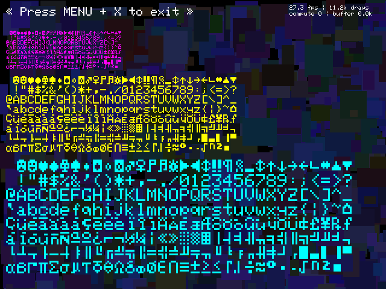
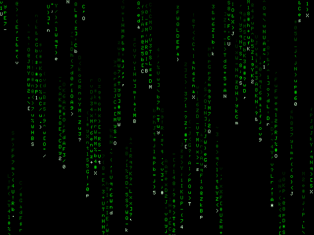
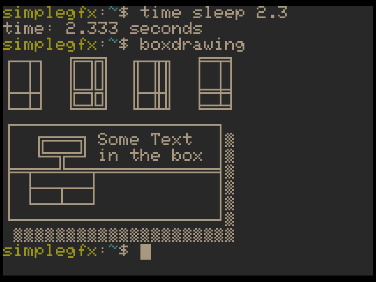
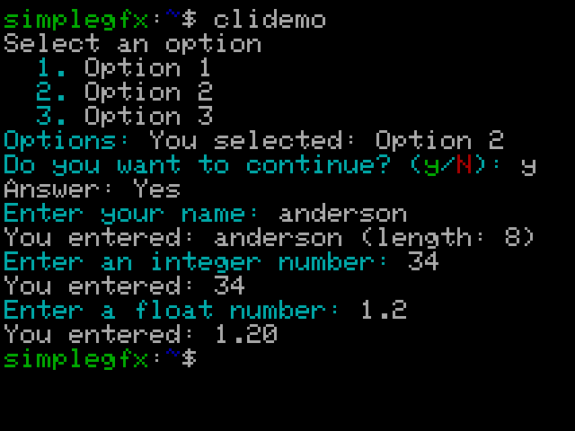
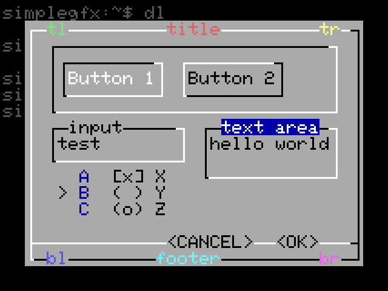

# SimpleGFX

SimpleGFX is a straightforward tool designed to help you create graphics using SDL 1.2 or SDL 2. It supports development for the Anbernic RG35xx running Onion OS 1.4.9 and can also be used on macOS for experimenting, building, and testing small graphical applications.

## Features

- Compatibility with SDL 1.2 and SDL 2.
- Supports macOS and RG35xx platforms.
- Basic text rendering functionality.
- 16-bit tone generation for simple sound effects.
- Minimal dependencies for portability and ease of use.
- Can be used in embedded projects.







## System Requirements

### macOS

- For native development:
  - GNU Make (check with `make --version`)
- For RG35xx cross-compilation:
  - Docker installed and set up
- To use SDL backend you have the options:
  1. Use nix:
    - `nix-shell` (all dependencies will be set up automatically)
  2. Install SDL2 and SDL 1.2 compatibility:
    - SDL2 (`brew install sdl2`)
    - SDL 1.2 compatibility (`brew install sdl12-compat`)
    - ADB (`brew install android-platform-tools`)

### RG35xx

- Onion OS 1.4.9
- ADB enabled on the device (Consoles -> APPS -> Toggle_ADB)

### Embedded Projects

- Any platform that supports C/C++ and has a display driver.
- Define `WINDOW_WIDTH` and `WINDOW_HEIGHT` constants.
- Use `uint16_t* gfx_get_frame_buffer(void)` to get the frame buffer or implement your own backend.

### Basic Runtime

- Call `gfx_app(0 or more)` to run the application setup.
- Call `gfx_app(-1)` to run the application cleanup.
- Define a function `X`, that should:
  - Check for input and call `int gfx_on_key(char key, int down)`
  - Compute FPS and call `gfx_draw(float fps)` and `gfx_clear()`
    - Note: if `gfx_draw` returns 0, the draw operation should be skipped.
  - On remaining time until (1000ms / GFX_FPS) after draw you can:
    - Busy-wait calling `gfx_process_data` passing the remaining time in milliseconds.
    - Perform a optmized sleep using the sleep function provided by the platform.

## Installation

### macOS

Run the following commands to build and test the application:

```bash
# Using native (without nix)
$ make macos-gfx-run

# Using SDL2
$ make sdl-gfx-run

# Using SDL1.2
$ make sdl1.2-gfx-run

# Anbernic RG35xx
$ make rg35xx-gfx-run
```

> `$ make <plaform>-<example>-run`

### RG35xx

To build and install the application on RG35xx:

```bash
make rg35xx-gfx-adb-install
```

Ensure that ADB is properly configured and the device is connected before running this command.

## Usage

- Explore the example code provided in `examples/gfx.c`.
- The example demonstrates rendering random rectangles and drawing text on the screen.

## License

This project is distributed under the CC0 license, allowing unrestricted use, modification, and distribution.

## Contributions

If you successfully compile this on Windows or Linux (Linux support will be updated after the end-of-year holidays) and can adapt the Makefile while keeping it organized and consistent, please consider submitting a pull request. Your contributions would be greatly appreciated and integrated into the project.

## Additional Information

- This tool is designed for small, simple projects.
- Includes Makefile targets to simplify building and installing on RG35xx.
- Features are intentionally basic to ensure portability and simplicity.

## Acknowledgments

Special thanks to [https://github.com/nfriedly/miyoo-toolchain](https://github.com/nfriedly/miyoo-toolchain) for providing a Docker image with a precompiled toolchain, streamlining RG35xx development.

